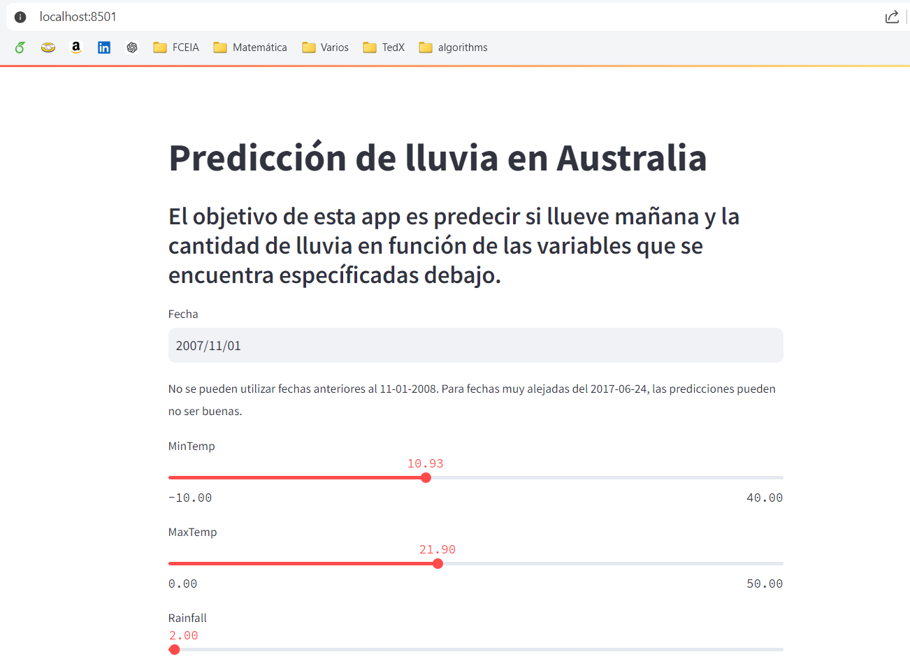

# Machine Learning #

## Description ##

This GitHub repository contains Python code that analyzes climatological data from Australia. The goal is to predict whether it will rain tomorrow (using classification models) and how much it will rain in millimeters (using regression models).

### Regression Analysis ###

1. **Data Preparation**: We start by reading the dataset, conducting exploratory data analysis (EDA), studying outliers and missing values, and transforming categorical variables.

2. **Data Visualization and Imputation**: We propose various data visualizations and impute missing values using different techniques while ensuring no data leakage occurs.

3. **Regression Models**: We evaluate linear regression models, Ridge regression, Lasso regression, and ElasticNet to predict how much rain will fall tomorrow.

4. **Hyperparameter Tuning**: Gradient descent is used to fine-tune the hyperparameters of the models.

5. **Logistic Regression**: We assess logistic regression models to determine if it will rain tomorrow or not.

6. **Baseline Models and Interpretability**: Baseline dummy models are generated for comparison, and we perform an interpretability analysis of the results up to this point.

### Neural Networks ###

1. **Training Neural Networks**: Using the same dataset, we train one neural network for classification and another for regression, optimizing hyperparameters using various methods (e.g., grid search, random search, gradient descent).

2. **Model Explainability with SHAP**: We utilize SHAP (SHapley Additive exPlanations) to provide interpretability and explainability for our neural network models.

### Application ###

Based on our conclusions, we selected an ElasticNet model to predict the amount of rainfall and a classification neural network to decide whether it will rain or not. We trained our models, optimized hyperparameters, and generated a Python object locally with our models. These models are then deployed in a Streamlit application, which provides a local user interface to generate new predictions based on new input data.


## App execution



Install the required libraries:

```bash
pip install streamlit pandas numpy optuna mpl_toolkits tensorflow warnings sklearn matplotlib seaborn
```

And within the app directory, run this command:

```bash
streamlit run app.py
```